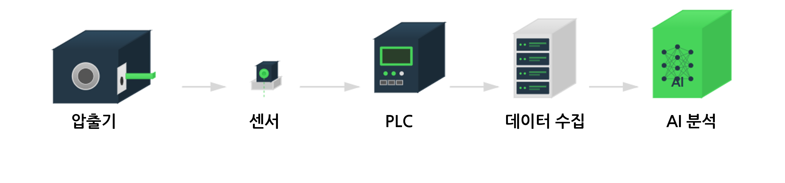
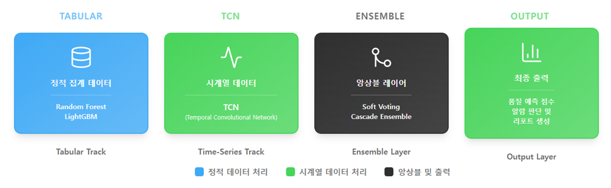

# MetraForge AI — AI 기반 지능형 금속가공 품질 향상 시스템

> 제5회 K-인공지능 제조데이터 분석 경진대회 | Hunters42 출품작

소성가공 압출공정의 센서 데이터를 기반으로 불량 발생을 사전에 탐지하는 **AI 품질보증 조기경보 시스템**을 구축했습니다.
데이터 품질 확보 → 하이브리드 모델링(TCN + LightGBM) → 운영 시각화까지 전 과정을 통합한 **End-to-End AI 분석 파이프라인**입니다.

> 현재 프론트엔드는 개발 예정 단계이며, 본 리포지토리는 **모델 설계·학습·평가까지 완료된 기술적 기반 버전**을 중심으로 구성되어 있습니다.
> 추후 FastAPI 및 React 기반의 실시간 대시보드 형태로 고도화될 예정입니다.

---

## Project Overview

금속가공 압출공정에서 발생하는 센서 데이터를 기반으로, 온도·압력·속도·부하 등의 변화를 AI가 실시간으로 분석해 품질 이상을 조기 감지하는 시스템입니다.


*그림 1. 공정 개요 및 데이터 수집 흐름 — 압출기 → 센서 → PLC → 데이터 수집 → AI 분석*

본 프로젝트의 데이터는 5초 간격으로 PLC를 통해 수집되며, 총 17,000행 × 20열 규모의 정형 시계열 데이터입니다.
데이터 품질 향상, 모델 학습, 해석(XAI) 단계를 통해 실제 제조라인에 적용 가능한 조기경보 체계를 구현했습니다.

---

## Hybrid Model Architecture

MetraForge AI는 **정적 탭형 데이터(Tabular)** 와 **시계열 데이터(Time-Series)** 를 동시에 처리하는 하이브리드 구조로 설계되었습니다.
이를 통해 센서 간 상호관계와 시간적 패턴을 통합적으로 학습하며, Soft·Cascade 앙상블을 통해 탐지력과 안정성을 동시에 확보합니다.


*그림 2. SmartForge AI 하이브리드 모델 구조 — Tabular + TCN + Ensemble + Output*

---

## 주요 기능

* **데이터 품질 확보:** 결측·이상치 자동 정제 및 품질지수 100% 달성
* **AI 품질 예측:** TCN 기반 시계열 모델과 LightGBM 앙상블 결합
* **성능 평가:** PR-AUC 0.9667, ROC-AUC 0.9983 달성
* **XAI 해석 지원:** SHAP, PDP, TCN 열지도 기반 알람별 원인 분석
* **고도화 방향:** FastAPI + React + MLflow 기반 MLOps MVP 구축 예정

---

## 모델 구조 세부 설명

### 🔹 Tabular Track (정적 집계 데이터)

* RandomForest, LightGBM 기반의 정적 변수 집계 모델
* Isotonic Calibration으로 확률 신뢰도 보정

### 🔹 Time-Series Track (시계열 데이터)

* Temporal Convolutional Network (TCN) 기반
* 센서 간 공변동 및 비정상 패턴을 통합 학습
* ChaMTeC (Delibasoglu et al., 2025) 구조 아이디어를 참고하여 Channel-Mixing 설계 적용

### 🔹 Ensemble Layer (앙상블 결합)

* Soft Voting (탐지력 중심) + Cascade (오탐 억제 중심) 하이브리드 구조
* 운영 정책 A/B/C 모드별 임계값 설정으로 유연한 대응

---

## 성능 요약

| 모델          | PR-AUC     | ROC-AUC    | 주요 특징     |
| ----------- | ---------- | ---------- | --------- |
| TCN         | 0.9621     | 0.9979     | 탐지력 중심    |
| Cascade 앙상블 | 0.8538     | 0.9070     | 오탐 억제 중심  |
| Soft 앙상블    | **0.9667** | **0.9983** | 균형형 최종 모델 |

> Soft + Cascade 하이브리드 구조로 **탐지력(정확도)** 과 **운영 안정성(오탐 최소화)** 을 동시에 달성.

### 주요 시각화 결과

| 구분               | README 이미지                                                                        | 원본 파일                             |
| ---------------- | --------------------------------------------------------------------------------- | --------------------------------- |
| ROC 곡선 (TCN 단일)  | `evals/roc_curve.png`                                                             | `evals/roc_curve.png`             |
| PR 곡선 (TCN 단일)   | `evals/pr_curve.png`                                                              | `evals/pr_curve.png`              |
| Threshold Sweep  | `evals/threshold_sweep.png`                                                       | `evals/threshold_sweep.png`       |
| Confusion Matrix | `evals/confusion_matrix_best.png`                                                 | `evals/confusion_matrix_best.png` |
| Soft 앙상블         | `evals_ensemble/soft/pr_soft.png`, `evals_ensemble/soft/roc_soft.png`             | `evals_ensemble/soft/`            |
| Cascade 앙상블      | `evals_ensemble/cascade/pr_cascade.png`, `evals_ensemble/cascade/roc_cascade.png` | `evals_ensemble/cascade/`         |
| 확률 히스토그램         | `evals/prob_hist.png`                                                             | `evals/prob_hist.png`             |

<details>
<summary>📎 추가 시각화(부록) 보기</summary>

* 제약 혼동행렬(운영조건 적용): `evals/confusion_matrix_constrained.png`
* 앙상블 채널별/트랙별 그래프: `evals_ensemble/soft|cascade/*_dl.png`, `*_tab.png`, `hist_*.png`
* 세부 지표 텍스트/요약: `evals/metrics.txt`, `evals_ensemble/*/metrics_*.txt`, `evals/eval_summary.json`

</details>

---

## 향후 고도화 방향

* **FastAPI 기반 추론 API** 구축 → `/predict`, `/threshold`, `/dashboard` 엔드포인트 예정
* **React 기반 시각화 대시보드** → KPI 카드, 알람 로그 타임라인, SHAP 해석뷰 제공
* **MLflow 통합** → 모델 버전 관리 및 성능 비교 자동화
* **Docker + AWS 배포** → 경진대회 이후 실서비스형 확장 준비

---

## References

1. Delibasoglu, I., Balta, D., & Balta, M. (2025). *ChaMTeC: CHAnnel Mixing and TEmporal Convolution Network for Time-Series Anomaly Detection.* *Applied Sciences,* 15(10), 5623.
2. Ke, G., Meng, Q., Finley, T., Wang, T., Chen, W., Ma, W., Ye, Q., & Liu, T.-Y. (2017). *LightGBM: A Highly Efficient Gradient Boosting Decision Tree.* *Advances in Neural Information Processing Systems (NIPS),* Long Beach, CA, USA.

> 본 프로젝트의 설계 아이디어는 위 논문들의 구조적 접근법을 참고하였으나,
> 모든 데이터 처리·모델링·시각화 코드는 직접 구현한 결과입니다.

---

## 파일 구조

```
KAMP_METRAFORGEAI/
 ├─ dataset/
 │   ├─ final_prepared.csv
 │   ├─ train_features_60m.csv
 │   ├─ holdout_probs.csv
 │
 ├─ evals/
 │   ├─ calibration_curve.png
 │   ├─ confusion_matrix_best.png
 │   ├─ confusion_matrix_constrained.png
 │   ├─ pr_curve.png
 │   ├─ roc_curve.png
 │   ├─ threshold_sweep.png
 │   ├─ prob_hist.png
 │   ├─ metrics.txt
 │   ├─ eval_summary.json
 │   ├─ process_pipeline.png
 │   ├─ hybrid_model_architecture.png
 │
 ├─ evals_ensemble/
 │   ├─ cascade/
 │   │   ├─ hist_cascade.png
 │   │   ├─ hist_dl.png
 │   │   ├─ hist_tab.png
 │   │   ├─ holdout_probs_cascade.csv
 │   │   ├─ metrics_cascade.txt
 │   │   ├─ pr_cascade.png
 │   │   ├─ roc_cascade.png
 │   │   ├─ pr_dl.png
 │   │   ├─ pr_tab.png
 │   │   ├─ roc_dl.png
 │   │   ├─ roc_tab.png
 │   ├─ soft/
 │   │   ├─ hist_soft.png
 │   │   ├─ hist_dl.png
 │   │   ├─ hist_tab.png
 │   │   ├─ holdout_probs_soft.csv
 │   │   ├─ metrics_soft.txt
 │   │   ├─ pr_soft.png
 │   │   ├─ roc_soft.png
 │   │   ├─ pr_dl.png
 │   │   ├─ pr_tab.png
 │   │   ├─ roc_dl.png
 │   │   ├─ roc_tab.png
 │
 ├─ ipynb/
 │   ├─ preprocessing.ipynb
 │   ├─ RF_LGBM.ipynb
 │   ├─ TCN.ipynb
 │   ├─ final_dualmode.ipynb
 │   └─ 2. 소성가공 품질보증 AI 데이터셋.csv
 │
 ├─ models/
 │   ├─ model_artifacts.pkl
 │   ├─ model_LightGBM.pkl
 │   ├─ model_RF_calibrated.pkl
 │   └─ model_meta.json
 │
 ├─ 2. 소성가공 품질보증 AI 데이터셋.csv
 ├─ hybrid_ensemble_eval_v2.py
 ├─ kamp_pipeline_lite.py
 ├─ train_deep_tcn_clean_v2_evals.py
 ├─ train_ensemble.py
 └─ README.md
```

> ℹ️ **노트북 경로 안내**: `ipynb/` 폴더에서 각 단계별 노트북을 확인할 수 있으며, 모델 가중치와 아티팩트는 `models/` 폴더에 저장됩니다. `kamp_pipeline_lite.py`는 전처리→추론→평가 파이프라인의 라이트 버전입니다.
